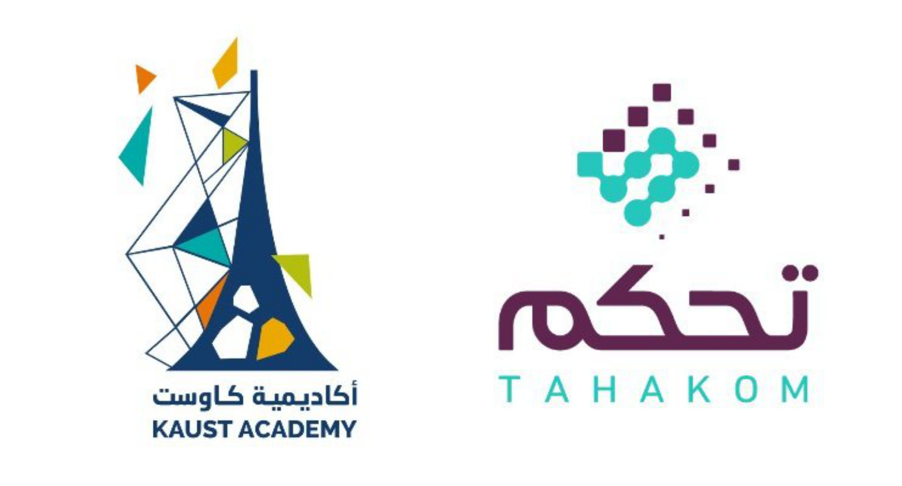

<!-- PROJECT LOGO -->
<br />
<div align="center">
  <a href="https://github.com/edmav4/BiPer">
    
  </a>

  <h3 align="center">KAUST Computer Vision Training Program</h3>
  <p align="center">
    <!-- Binary Neural Networks using a Periodic Function -->
    <!-- <br /> -->
    <a href="">Slides</a>
    ·
    <!-- <a href=""></a> -->
    <!-- · -->
    <a href="">GitHub</a>
  </p>
</div>

<!-- ### News and Updates :newspaper_roll:

**May 5, 2024**
- .. -->

## Program Overview

KAUST Academy's AI Training program offers a comprehensive four-week journey into the world of Computer Vision. In today's rapidly evolving field of computer vision and deep learning, staying at the forefront of research and practical applications is essential. To address the growing demand for expertise in cutting-edge topics, we designed a comprehensive training program that covers a range of critical areas in computer vision and machine learning. This program aims to equip participants from TAHAKOM with the knowledge and hands-on skills required to excel in various domains, including vision-based AI, video understanding, advanced training paradigms, and multi-modal learning.

## Course Schedule
<!-- TABLE OF CONTENTS -->
<details>
  <summary>Table of Contents</summary>
  <ul>
    <li>
      <p>Week 1: Transformer for Vision</p>
      <ol>
        <li>Introduction to Transformers Network</li>
        <li>Vision Transformer</li>
        <li>Transformers in Computer Vision</li>
        <li>Vision Transformers for Downstream Tasks</li>
        <li>Advanced Topics and Emerging Trends</li>
      </ol>
    </li>
    <li>
    <p>Week 3: Beyond the Supervised Training Paradigm</p>
    <ol>
        <li>Introduction to Self-Supervised Learning (SSL)</li>
        <li>Advanced SSL Techniques and Applications</li>
        <li>Exploring Generalization Abilities of Computer Vision Models</li>
        <li>Addressing Data Scarcity in Computer Vision</li>
        <li>Improving Computer Vision models efficiency</li>
      </ol>
    </li>
  <ul>
</details>

## Getting Started
### Prerequisites
```bash
conda create --prefix ./venv python=3.10.12
conda activate ./venv
pip install jupyter
```


## Launch the repository on KAUST ClassHub
<!-- [![badge](https://img.shields.io/badge/launch-KAUST%20ClassHub-579ACA.svg?logo=data:image/png;base64,iVBORw0KGgoAAAANSUhEUgAAAFkAAABZCAMAAABi1XidAAAB8lBMVEX///9XmsrmZYH1olJXmsr1olJXmsrmZYH1olJXmsr1olJXmsrmZYH1olL1olJXmsr1olJXmsrmZYH1olL1olJXmsrmZYH1olJXmsr1olL1olJXmsrmZYH1olL1olJXmsrmZYH1olL1olL0nFf1olJXmsrmZYH1olJXmsq8dZb1olJXmsrmZYH1olJXmspXmspXmsr1olL1olJXmsrmZYH1olJXmsr1olL1olJXmsrmZYH1olL1olLeaIVXmsrmZYH1olL1olL1olJXmsrmZYH1olLna31Xmsr1olJXmsr1olJXmsrmZYH1olLqoVr1olJXmsr1olJXmsrmZYH1olL1olKkfaPobXvviGabgadXmsqThKuofKHmZ4Dobnr1olJXmsr1olJXmspXmsr1olJXmsrfZ4TuhWn1olL1olJXmsqBi7X1olJXmspZmslbmMhbmsdemsVfl8ZgmsNim8Jpk8F0m7R4m7F5nLB6jbh7jbiDirOEibOGnKaMhq+PnaCVg6qWg6qegKaff6WhnpKofKGtnomxeZy3noG6dZi+n3vCcpPDcpPGn3bLb4/Mb47UbIrVa4rYoGjdaIbeaIXhoWHmZYHobXvpcHjqdHXreHLroVrsfG/uhGnuh2bwj2Hxk17yl1vzmljzm1j0nlX1olL3AJXWAAAAbXRSTlMAEBAQHx8gICAuLjAwMDw9PUBAQEpQUFBXV1hgYGBkcHBwcXl8gICAgoiIkJCQlJicnJ2goKCmqK+wsLC4usDAwMjP0NDQ1NbW3Nzg4ODi5+3v8PDw8/T09PX29vb39/f5+fr7+/z8/Pz9/v7+zczCxgAABC5JREFUeAHN1ul3k0UUBvCb1CTVpmpaitAGSLSpSuKCLWpbTKNJFGlcSMAFF63iUmRccNG6gLbuxkXU66JAUef/9LSpmXnyLr3T5AO/rzl5zj137p136BISy44fKJXuGN/d19PUfYeO67Znqtf2KH33Id1psXoFdW30sPZ1sMvs2D060AHqws4FHeJojLZqnw53cmfvg+XR8mC0OEjuxrXEkX5ydeVJLVIlV0e10PXk5k7dYeHu7Cj1j+49uKg7uLU61tGLw1lq27ugQYlclHC4bgv7VQ+TAyj5Zc/UjsPvs1sd5cWryWObtvWT2EPa4rtnWW3JkpjggEpbOsPr7F7EyNewtpBIslA7p43HCsnwooXTEc3UmPmCNn5lrqTJxy6nRmcavGZVt/3Da2pD5NHvsOHJCrdc1G2r3DITpU7yic7w/7Rxnjc0kt5GC4djiv2Sz3Fb2iEZg41/ddsFDoyuYrIkmFehz0HR2thPgQqMyQYb2OtB0WxsZ3BeG3+wpRb1vzl2UYBog8FfGhttFKjtAclnZYrRo9ryG9uG/FZQU4AEg8ZE9LjGMzTmqKXPLnlWVnIlQQTvxJf8ip7VgjZjyVPrjw1te5otM7RmP7xm+sK2Gv9I8Gi++BRbEkR9EBw8zRUcKxwp73xkaLiqQb+kGduJTNHG72zcW9LoJgqQxpP3/Tj//c3yB0tqzaml05/+orHLksVO+95kX7/7qgJvnjlrfr2Ggsyx0eoy9uPzN5SPd86aXggOsEKW2Prz7du3VID3/tzs/sSRs2w7ovVHKtjrX2pd7ZMlTxAYfBAL9jiDwfLkq55Tm7ifhMlTGPyCAs7RFRhn47JnlcB9RM5T97ASuZXIcVNuUDIndpDbdsfrqsOppeXl5Y+XVKdjFCTh+zGaVuj0d9zy05PPK3QzBamxdwtTCrzyg/2Rvf2EstUjordGwa/kx9mSJLr8mLLtCW8HHGJc2R5hS219IiF6PnTusOqcMl57gm0Z8kanKMAQg0qSyuZfn7zItsbGyO9QlnxY0eCuD1XL2ys/MsrQhltE7Ug0uFOzufJFE2PxBo/YAx8XPPdDwWN0MrDRYIZF0mSMKCNHgaIVFoBbNoLJ7tEQDKxGF0kcLQimojCZopv0OkNOyWCCg9XMVAi7ARJzQdM2QUh0gmBozjc3Skg6dSBRqDGYSUOu66Zg+I2fNZs/M3/f/Grl/XnyF1Gw3VKCez0PN5IUfFLqvgUN4C0qNqYs5YhPL+aVZYDE4IpUk57oSFnJm4FyCqqOE0jhY2SMyLFoo56zyo6becOS5UVDdj7Vih0zp+tcMhwRpBeLyqtIjlJKAIZSbI8SGSF3k0pA3mR5tHuwPFoa7N7reoq2bqCsAk1HqCu5uvI1n6JuRXI+S1Mco54YmYTwcn6Aeic+kssXi8XpXC4V3t7/ADuTNKaQJdScAAAAAElFTkSuQmCC)](https://binder.kaust.edu.sa/v2/gh/IVUL-KAUST/TahakomTraining/main?labpath=vision-transformer-vit-tutorial-baseline.ipynb) -->


## Use in the public cloud

### Week 1: Transformer for Vision
| **Tutorial** | **Open in Google Colab** | **Open in Kaggle** |
|--------------|:------------------------:|:------------------:|
| 1. Intro: Transformer | [](https://colab.research.google.com/github/IVUL-KAUST/TahakomTraining/blob/main/Week-1-Transformers/Day1-Intro-Transformer.ipynb) | [](https://kaggle.com/kernels/welcome?src=https://github.com/IVUL-KAUST/TahakomTraining/blob/main/Week-1-Transformers/Day1-Intro-Transformer.ipynb) |
| 2. Vision Transformer | [](https://colab.research.google.com/github/IVUL-KAUST/TahakomTraining/blob/main/Week-1-Transformers/Day2-Vision-Transformer.ipynb) | [](https://kaggle.com/kernels/welcome?src=https://github.com/IVUL-KAUST/TahakomTraining/blob/main/Week-1-Transformers/Day2-Vision-Transformer.ipynb) |
| 3. Transformer vs CNN | | [](https://www.kaggle.com/code/fuankarion/cifar100competition) |
| 4. DETR | [](https://colab.research.google.com/github/facebookresearch/detr/blob/colab/notebooks/detr_attention.ipynb#scrollTo=frMO0BaCYTEr) | [](https://www.kaggle.com/code/fuankarion/detr-train) |


### Week 3: Beyond the Supervised Training Paradigm
| **Tutorial** | **Open in Google Colab** | **Open in Kaggle** |
|--------------|:------------------------:|:------------------:|
| 1.1. Introduction to SSL | [](https://colab.research.google.com/github/IVUL-KAUST/TahakomTraining/blob/main/Week-3-SSL/Notebooks/Day-1-Intro-SSL/Day1-Intro-SSL-Rotnet.ipynb) | [](https://kaggle.com/kernels/welcome?src=https://github.com/IVUL-KAUST/TahakomTraining/blob/main/Week-3-SSL/Notebooks/Day-1-Intro-SSL/Day1-Intro-SSL-Rotnet.ipynb) |
| 1.2. Introduction to SSL | [](https://colab.research.google.com/github/IVUL-KAUST/TahakomTraining/blob/main/Week-3-SSL/Notebooks/Day-1-Intro-SSL/Day1-Intro-SSL-SimCLR.ipynb) | [](https://kaggle.com/kernels/welcome?src=https://github.com/IVUL-KAUST/TahakomTraining/blob/main/Week-3-SSL/Notebooks/Day-1-Intro-SSL/Day1-Intro-SSL-SimCLR.ipynb) |
| 2. MAE | [](https://colab.research.google.com/github/IVUL-KAUST/TahakomTraining/blob/main/Week-3-SSL/Notebooks/Day-2-MAE/day2-mae.ipynb) | [](https://kaggle.com/kernels/welcome?src=https://github.com/IVUL-KAUST/TahakomTraining/blob/main/Week-3-SSL/Notebooks/Day-2-MAE/day2-mae.ipynb) |
| 3. Domain Adaptation | [](https://colab.research.google.com/github/IVUL-KAUST/TahakomTraining/blob/main/Week-3-SSL/Notebooks/Day-3-DG/day3-adda.ipynb) | [](https://kaggle.com/kernels/welcome?src=https://github.com/IVUL-KAUST/TahakomTraining/blob/main/Week-3-SSL/Notebooks/Day-3-DG/day3-adda.ipynb) |
| 4. Data Scarcity | [](https://colab.research.google.com/github/IVUL-KAUST/TahakomTraining/blob/main/Week-3-SSL/Notebooks/Day-4-Data-Scarcity/Day_4_data_scarcity.ipynb) | [](https://kaggle.com/kernels/welcome?src=https://github.com/IVUL-KAUST/TahakomTraining/blob/main/Week-3-SSL/Notebooks/Day-4-Data-Scarcity/Day_4_data_scarcity.ipynb) |